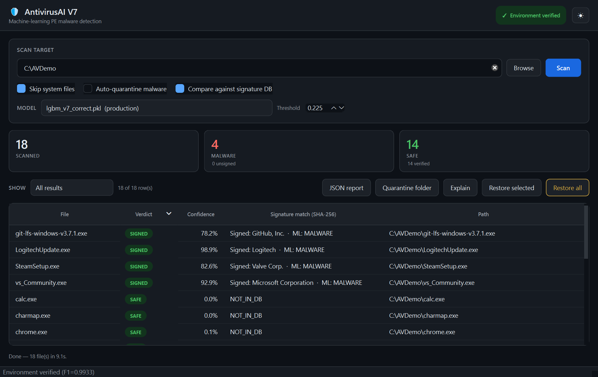
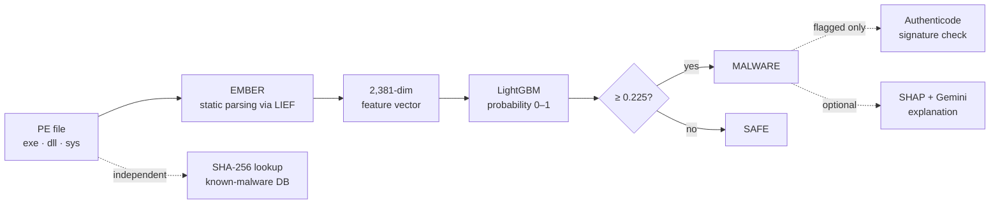
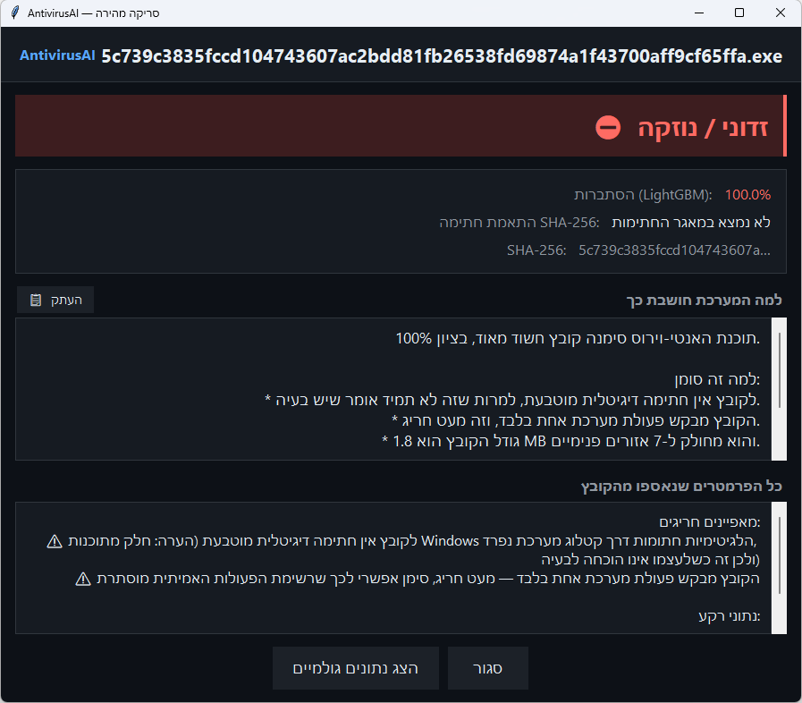
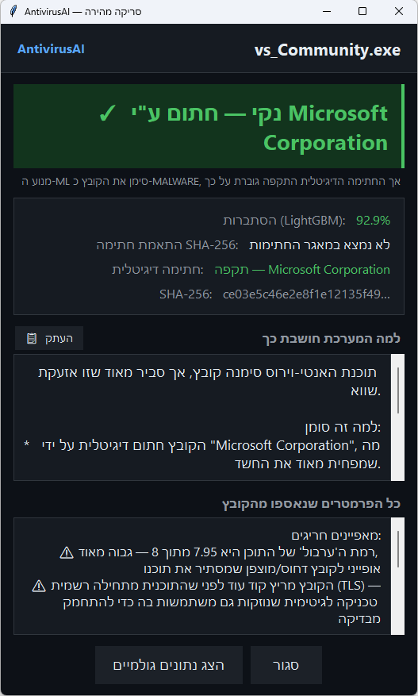
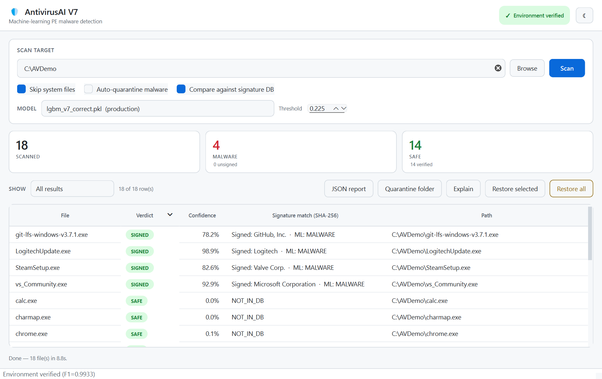

<div align="center">

# 🛡️ AntivirusAI V7

**Static, machine-learning malware detection for Windows executables, without running the file.**




</div>

---

## Overview

Classic antivirus engines rely on a database of known file fingerprints (hashes). That catches malware that has already been seen. A brand-new sample, or a known one with a single byte changed, doesn't match anything.

**AntivirusAI** asks a different question: *does this file look like it was built like malware?* Every Portable Executable (`.exe`, `.dll`, `.sys`) is parsed statically into **2,381 structural features** (entropy, import table, section layout, strings, header fields) and scored by a **LightGBM** model trained on **81,011 real Windows executables**.

The model sits inside a complete Windows desktop application: a GUI, a command-line scanner, a right-click quick-scan, quarantine and restore, JSON reports, and three independent supporting layers.

> Final-year project. The numbers below are all measured on data the model never trained on. See [Results](#-results).

## ✨ Features

| | |
|---|---|
| 🧠 **ML detection** | LightGBM on EMBER v2 features. Detects malware by structure, not by fingerprint |
| #️⃣ **SHA-256 layer** | Exact-match lookup against a local database of known malware, recorded *side by side* with the ML verdict so you can see what ML caught that hashes missed |
| ✅ **Authenticode layer** | Verifies the digital signature of flagged files offline via the Win32 `WinVerifyTrust` API. A validly signed file is reported but not auto-quarantined |
| 💬 **Explanations** | SHAP ranks which feature groups drove the decision; Gemini (optional) writes a short, plain-language "why", allowed to quote **only real measurements** from the file |
| 🔒 **Quarantine** | Copy → verify hash → XOR-neutralise → remove original. Full restore by SHA-256 |
| 🖱️ **Right-click scan** | "AntivirusAI: quick scan" in the Explorer context menu for `.exe` files (per-user, no admin) |
| 🩺 **Startup self-check** | Every launch verifies pinned library versions, the EMBER patch, the model, and an F1 ≥ 0.98 regression test before any scan runs |
| 🌐 **Offline by design** | No network calls at scan time. File contents, names and paths never leave the machine |

## 🏗️ How it works



The three supporting layers **never change the model's verdict**. They are recorded alongside it, and only affect the *action* taken:

- A file that matches a **known-malware SHA-256** always stays red, even if signed. Attackers do steal code-signing certificates.
- A **validly signed** file that the model flagged is shown green (`SIGNED`) and skipped by auto-quarantine, while the original ML verdict stays visible in the UI and in the report.
- The **explanation** runs after the verdict and only describes it.

## 📊 Results

Production model `lgbm_v7_correct.pkl`, threshold **0.225**, evaluated on the held-out balanced test set (**12,153 files** never seen in training):

| Metric | Value |
|---|---|
| F1 score | **99.33%** |
| Recall (malware caught) | **99.26%** |
| Precision | 99.40% |
| False-positive rate | **0.91%** |
| ROC AUC | 0.9994 |

**Zero-day view:** of the **1,456** test-set malware samples that the model never trained on *and* that are withheld from the SHA-256 database, **ML caught 1,441 (98.97%)**. A hash lookup catches 0 of them by construction.

Run `python -m avscan demo-zeroday <folder>` to produce the same SHA-256-vs-ML comparison on your own files.

## 💡 What the project taught me

1. **Temporal shortcuts.** An earlier version flagged ~90% of Windows 11 system files as malware. The benign training files were from 2018 and the malware from 2024–2026, so the model learned "recent compile date = malware". Zeroing 10 time-related features, training only on recent data, and pinning the same LIEF build everywhere brought system-file false alarms down to **0.36%**.
2. **99% on a test set is not 99% in the wild.** On installers from vendors the model had never seen, **44.7%** of clean files were flagged. SHAP showed why: Go-built installers zero their timestamp and import almost nothing, which looks exactly like packed malware. Expanding the benign corpus and retraining brought that to **13.6%** (and 45.7% fewer false alarms on a 13,090-file real clean-folder test), and the Authenticode layer handles the rest.
3. **An explanation must be true before it is readable.** The first explanations were generic, and once the LLM presented an internal model weight as if it were a measurement. Now the prompt contains only measured values and the model may not write a number that does not appear in it.

## 📸 Screenshots

<table>
<tr>
<td align="center"><br><sub>Right-click scan: malware caught by ML only (not in the hash DB)</sub></td>
<td align="center"><br><sub>A signed Microsoft installer: ML flags it, the signature layer clears it</sub></td>
</tr>
<tr>
<td colspan="2" align="center"><br><sub>Main window, light theme</sub></td>
</tr>
</table>

## 🚀 Getting started

**Requirements:** Windows 10/11 and an internet connection for the one-time install. Python 3.11 is installed automatically if missing.

```powershell
git clone https://github.com/omritmanager/AntiVirusAI.git
cd AntiVirusAI
.\install_environment.bat
```

The installer creates `venv_v7`, installs the **exact pinned** library versions, installs and patches EMBER, registers the right-click entry, then runs the self-check and the full test suite to prove the environment works.

Then start the app:

```powershell
.\AntiVirusGUI.BAT
```

### Optional: AI explanations

The "why" explanation uses the Google Gemini API. Without a key, a local explanation built from the same measurements is shown instead. To enable it:

```powershell
setx GEMINI_API_KEY "your-key"
```

Only the verdict, the probability and abstract feature-group names / measurements are sent, never the file, its name or its path.

## 🖥️ Command line

```powershell
venv_v7\Scripts\python.exe -m avscan <command>
```

| Command | Description |
|---|---|
| `selfcheck` | Verify environment, model and regression F1 |
| `scan <folder>` | Scan a folder (`--report-only`, `--no-whitelist`, `--explain`, `--output report.json`, …) |
| `quickscan <file>` | Scan one file and show the verdict popup (`--text` for console output) |
| `demo-zeroday <folder>` | SHA-256 vs ML comparison table |
| `list-quarantine` | Show quarantined files |
| `restore <sha256\|all>` | Restore from quarantine |

Exit codes: `0` clean · `1` malware found · `2` error / self-check failed.

> **Tip:** for broad scans (e.g. a whole drive) use `--report-only`. The model has a real false-positive rate on modern installers and packed executables.

## 📁 Project structure

```
avscan/               Application package
  engine.py           Feature extraction + LightGBM inference
  orchestrator.py     Scan pipeline (whitelist → ML → hash → signature → action)
  hashdb.py           SHA-256 known-malware lookup (local SQLite)
  signature.py        Authenticode verification (ctypes → wintrust / crypt32)
  explain.py          SHAP attribution, evidence extraction, Gemini prompt
  quarantine.py       Verified, XOR-neutralised quarantine and restore
  selfcheck.py        Mandatory startup verification
  gui.py / theme.py   PySide6 desktop GUI and shared design tokens
  quickscan.py        Right-click single-file scan popup
  cli.py              Command-line interface
config/               Behaviour settings and system-path whitelist
models/v7/            Production model + calibrated thresholds
src/training/v7/      Data collection, feature extraction, training and evaluation pipeline
src/augmentation/     Benign-corpus augmentation (dedup, anti-poisoning filter)
tests/avscan_tests/   199 pytest tests
```

## 🧪 Tests

```powershell
venv_v7\Scripts\python.exe -m pytest tests/avscan_tests -q
```

199 tests cover the engine, hash DB, orchestrator, quarantine round-trips, signature policy, explanation grounding, reports and the GUI (run headless).

## ⚠️ Limitations

- **Static analysis of Windows PE files only.** Malware that downloads its real payload at runtime can look benign.
- All training malware comes from a single source (MalwareBazaar).
- The SHA-256 database (built from the training dataset) is **not included** in this repository. Without it the scanner runs ML-only and says so.
- This is an academic project, **not a replacement for a commercial antivirus.**

## 🔧 Tech stack

Python 3.11 · LightGBM · scikit-learn · EMBER / LIEF · SHAP (LightGBM `pred_contrib`) · Google Gemini API · PySide6 (Qt) · Tkinter · Win32 API via `ctypes` · SQLite · pytest

## 🙏 Acknowledgements

- [EMBER](https://github.com/elastic/ember) (Elastic): the PE feature-extraction framework
- [LIEF](https://lief.re): PE parsing
- [MalwareBazaar](https://bazaar.abuse.ch) (abuse.ch): malware samples for training

---

<div dir="rtl">

### 🇮🇱 בקצרה

**AntivirusAI** הוא פרויקט גמר: אנטי-וירוס ל-Windows שמזהה נוזקות לפי **המבנה** של קובץ ההרצה, בלי להריץ אותו. כל קובץ מתורגם ל-2,381 מאפיינים סטטיים, ומודל LightGBM שאומן על 81,011 קבצים אמיתיים נותן לו ציון. על 12,153 קבצים שהמודל לא ראה באימון הוא הגיע ל-F1 של 99.33% ול-0.91% התרעות שווא. לצד המודל יש שלוש שכבות עצמאיות: השוואת SHA-256, אימות חתימה דיגיטלית והסבר בשפה טבעית. הסריקה רצה מקומית לגמרי.

</div>
